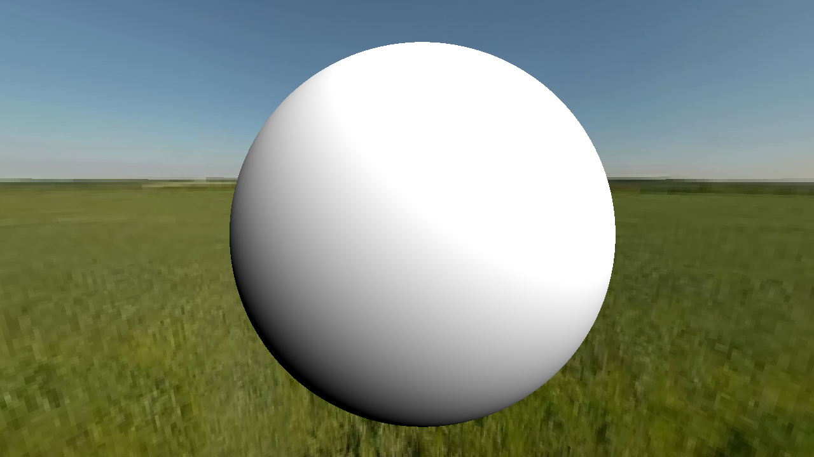

# Making a 3D renderer with SFML

i havn't decided if i do raytracing or raymarching,

but i want it modular and super simple.

## building

`./make build`

## running 

`./make run`

## freatures

The engin and the program are two separate things that compile separetely and then are link together.
If you just change the main.cpp or the camera.cpp or add new stuff to the program it can be compiled
just with `./make compile_src link`...
